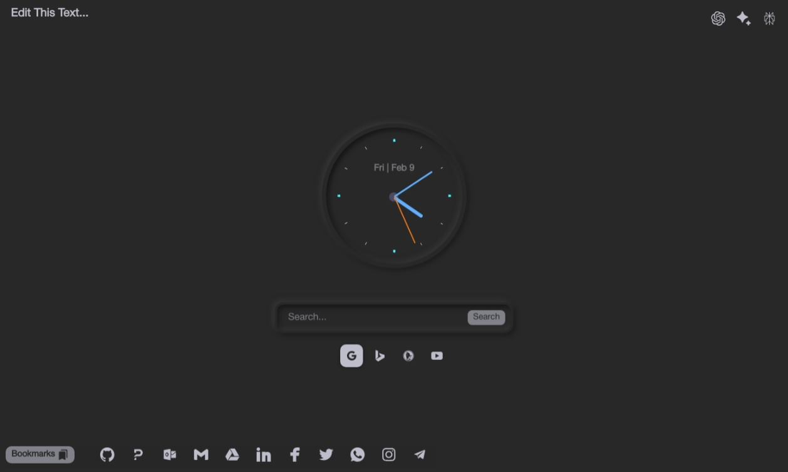

# `AionTab` 

## 📗 Table of Contents

- [`AionTab` ](#aiontab-)
  - [📗 Table of Contents](#-table-of-contents)
  - [📖 About AionTab Extension ](#-about-aiontab-extension-)
  - [🛠 Built With ](#-built-with-)
    - [⚙️ Tech Stack ](#️-tech-stack-)
    - [💡 Key Features ](#-key-features-)
  - [💻 Preview ](#-preview-)
  - [🚀 Extension Deployment Link ](#-extension-deployment-link-)
  - [💻 Getting Started ](#-getting-started-)
    - [Prerequisites](#prerequisites)
    - [Setup](#setup)
    - [Install](#install)
    - [Usage](#usage)
  - [👥 Developers ](#-developers-)
  - [🔭 Future Features ](#-future-features-)
  - [🤝 Contributing ](#-contributing-)
  - [⭐️ Show your support ](#️-show-your-support-)
  - [🙏 Acknowledgments ](#-acknowledgments-)
  - [📝 License ](#-license-)

## 📖 About AionTab Extension 

> **`AionTab`** is an extension for Chromium-based browsers like `Chrome`, `Chromium`, `Edge`, `Brave`, and others. It replaces the default new tab with a cool, dark-looking tab offering various functionalities. These include multiple search engine options, bookmarks for AI chat sites and utility sites, a stylish analog clock, and more.

## 🛠 Built With 

### ⚙️ Tech Stack 

> Here are the tech stacks applied in this project.

  
Markup

  <ul>
    <li>HTML5</li>
    <li>CSS3</li>
  </ul>

  
Languages

  <ul>
    <li>JavaScript</li>
  </ul>

(<a href="#readme-top">back to top</a>)

### 💡 Key Features 

> The following are the key features of the extension.

- Perform web search with the option of choosing from mulptiple search engine (`Google`, `Bing`, `DockDockGo`, `YouTube`)
- Easily access popular AI chats such as `ChatGPT`, `Gemini`, and `Perplexity`
- Easily access utility web applications such as `Gmail`, `Google Drive`, `GitHub`, `Facebook`, `LinkedIn`, `Twitter`, `WhatsApp`, `Telegram`, and `Instagram`.
- See a nice looking analogue clock with date and month
- Have a custom text displayed on the screen
<!-- Add more features as necessary -->

(<a href="#readme-top">back to top</a>)

## 💻 Preview 

> AionTab Extension preview

## 🚀 Extension Deployment Link 

> Coming soon ...

[Live Link](link)

(<a href="#readme-top">back to top</a>)

<!-- GETTING STARTED -->

## 💻 Getting Started 

> This guide details the steps to install `AionTab` extension on browsers that are built on the Chromium engine like Chrome, Chromium, Edge, Brave, and Opera.

### Prerequisites

> The following applications are required to be installed for the `AionTab` extension!

Install a modern browser e.g

- [Google Chrome](https://www.google.com/chrome/)
- [Chromium](https://www.chromium.org/getting-involved/download-chromium/)
- [Edge](https://www.microsoft.com/en-us/edge?r=1)
- [Brave](https://brave.com/)
- [Opera](https://www.opera.com/) etc.

(<a href="#readme-top">back to top</a>)

### Setup

> The following are setups for the `AionTab` extension before installation

- Create a new folder in your computer `Documents` folder and name the folder `Extensions`.
- Download the [AionTab](https://github.com/PraisesPJMT/AionTab-Extension/) using this link: [Downloan AionTab](https://github.com/PraisesPJMT/AionTab-Extension/archive/refs/heads/main.zip).
- Move the downloaded `AionTab-Extension-main.zip` zip file of the AionTab extension to the newly created `Extensions` folder.
- Extract the `AionTab-Extension-main.zip` file into the `Extensions` folder.

(<a href="#readme-top">back to top</a>)

### Install

> Follow these steps to install the `AionTab` extension on Chromium-based browsers:

1. **Enable Developer Mode:** In your browser's extensions settings (e.g., `chrome://extensions`), activate "Developer mode".
2. **Load Unpacked Extension:** `Click` "Load unpacked" and select the `AionTab-Extension-main` folder containing the `AionTab` extension.
3. **Reload for Updates:** Changes to your extension won't reflect automatically. `Right-click` the extension icon and select "Reload" to see updates.

(<a href="#readme-top">back to top</a>)

### Usage

> Open a new tab in your browser and enjoy using the `AionTab` extension.

(<a href="#readme-top">back to top</a>)

## 👥 Developers 

👤 **Praises Musa Tula**

> **Github:** [@PraisesPJMT](https://github.com/PraisesPJMT/)
>
> **LinkedIn:** [Praises Musa Tula](https://www.linkedin.com/in//username/)
>
> **Twitter:** [@PraisesPJMT](https://twitter.com/username/)
>
> **Email:** [praisesmusa@gmail.com](mailto:praisesmusa@gmail.com)

## 🔭 Future Features 

> The following are features to be expected in the future

- [ ] **Add functionality **for selecting **a **different**** color theme****
- [ ] **Add functionality for getting and displaying weather**
- [ ] **Add functionality for selecting clock displayed **as either **analog** or digital** form**
- [ ] **Add functionality for adding different timezones**

(<a href="#readme-top">back to top</a>)

## 🤝 Contributing 

Contributions, issues, and feature requests are welcome!

Feel free to check the [issues page](../../issues/).

(<a href="#readme-top">back to top</a>)

## ⭐️ Show your support 

Give a ⭐️ if you like this project!

(<a href="#readme-top">back to top</a>)

## 🙏 Acknowledgments 

UI inspired by [Simple Analog Clock Using Html, CSS & Javascript](https://dev.to/code_mystery/simple-analog-clock-using-html-css-javascript-2c6a) published by Foolish Developer

(<a href="#readme-top">back to top</a>)

## 📝 License 

This project is [MIT](./LICENSE) licensed.

**| PJMT |**
